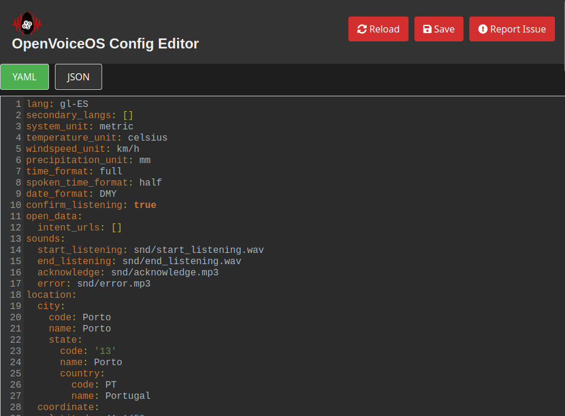
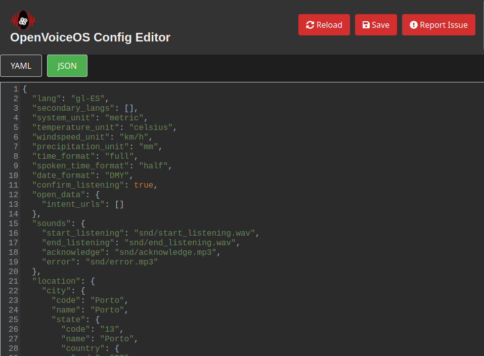

# OpenVoiceOS YAML Config Editor

The OpenVoiceOS Config Editor is a web application for OpenVoiceOS configuration files. It supports YAML and JSON formats. The editor gives you a simple interface to view, change, and save configuration data.

You can edit the configuration in two formats:
- **YAML**: this is the default format when you open the editor.
- **JSON**: switch to this format with the tabs in the editor.




## Features

- **Authentication**: the editor is protected with basic HTTP authentication.
- **Editor interface**: an interactive editor with syntax highlighting for YAML and JSON, powered by CodeMirror.
- **Save and reload**: save changes to the configuration files, or reload the current configuration into the editor.
- **Issue reporting**: a direct link to report issues on GitHub.
- **Responsive UI**: a clean interface with tabs to switch between YAML and JSON.

## Installation

1. Install from PyPI:
   ```bash
   pip install ovos-yaml-editor
   ```
2. Set the environment variables for authentication:
   ```bash
   export EDITOR_USERNAME="your_username"
   export EDITOR_PASSWORD="your_password"
   ```

   If you do not set these, the editor uses the defaults "admin" and "password".

## Usage

   ```bash
   $ ovos-yaml-editor --help
   Usage: ovos-yaml-editor [OPTIONS]
   
   Run the OpenVoiceOS config editor Web UI.
   
   Options:
   --host TEXT     Set to 0.0.0.0 to make externally accessible.
   --port INTEGER  Port to run the app on.
   --help          Show this message and exit.
   
   
   $ ovos-yaml-editor --host "0.0.0.0" --port 9200
   INFO:     Started server process [2633268]
   INFO:     Waiting for application startup.
   INFO:     Application startup complete.
   INFO:     Uvicorn running on http://0.0.0.0:9200 (Press CTRL+C to quit)
   ```

The application is available at `http://localhost:9200`.

## Authentication

The editor uses basic authentication. It reads the username and password from the environment variables `EDITOR_USERNAME` and `EDITOR_PASSWORD`. The default credentials are:
- **Username**: admin
- **Password**: password

## Related projects

- [OpenVoiceOS/ovos-config](https://github.com/OpenVoiceOS/ovos-config) — the configuration library this editor manages files for.
- [OpenVoiceOS/ovos-core](https://github.com/OpenVoiceOS/ovos-core) — the OpenVoiceOS voice assistant core.

---

## Credits

Developed by [TigreGótico](https://tigregotico.pt) for
[OpenVoiceOS](https://openvoiceos.org).

[](https://nlnet.nl/project/OpenVoiceOS)

This project was funded through the [NGI0 Commons Fund](https://nlnet.nl/commonsfund),
a fund established by [NLnet](https://nlnet.nl) with financial support from the
European Commission's [Next Generation Internet](https://ngi.eu) programme, under
the aegis of [DG Communications Networks, Content and Technology](https://commission.europa.eu/about-european-commission/departments-and-executive-agencies/communications-networks-content-and-technology_en)
under grant agreement No [101135429](https://cordis.europa.eu/project/id/101135429).
