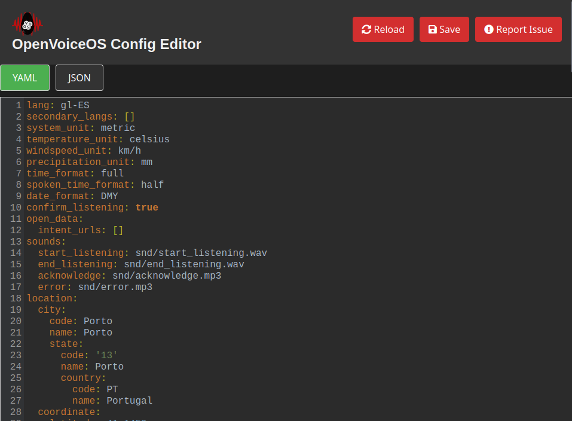
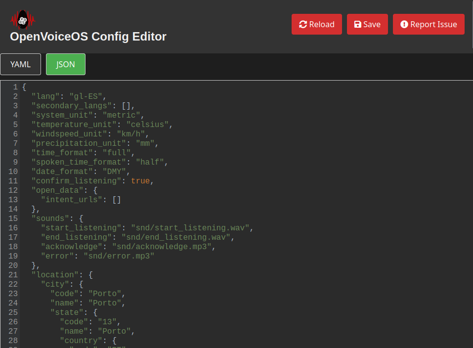

# OpenVoiceOS YAML Config Editor

The **OpenVoiceOS Config Editor** is a web-based application for managing and editing the configuration files of OpenVoiceOS, supporting YAML and JSON formats. It provides an easy-to-use interface for modifying and saving configuration data, making it simple for users to adjust system settings.

It allows editing the configuration in two formats:
- **YAML**: This is the default format when the editor is opened.
- **JSON**: Users can switch to this format using the tabs in the editor.
  



## Features

- **Authentication**: Password-protected editor with basic HTTP authentication.
- **Editor Interface**: Interactive editor with syntax highlighting for YAML and JSON formats, powered by CodeMirror.
- **Save and Reload**: Users can save changes to the configuration files and reload the current configuration into the editor.
- **Issue Reporting**: Direct link to report issues on GitHub.
- **Responsive UI**: Modern, clean user interface with tabs to switch between YAML and JSON formats.

## Requirements

- **Python 3.7+**
- **FastAPI**
- **Uvicorn**
- **Codemirror** (for syntax highlighting)
- **OpenVoiceOS Configuration** (`ovos_config` library)

## Installation

1. Clone the repository:
   ```bash
   git clone https://github.com/HiveMindInsiders/ovos-yaml-editor
   pip install ./ovos-yaml-editor
   ```
2. Set up environment variables for authentication:
   ```bash
   export EDITOR_USERNAME="your_username"
   export EDITOR_PASSWORD="your_password"
   ```

   (Defaults are "admin" and "password" if not set.)

## Usage

   ```bash
   $ ovos-yaml-editor --help
   Usage: ovos-yaml-editor [OPTIONS]
   
   Run the OpenVoiceOS config editor Web UI.
   
   Options:
   --host TEXT     Set to 0.0.0.0 to make externally accessible.
   --port INTEGER  Port to run the app on.
   --help          Show this message and exit.
   
   
   $ ovos-yaml-editor --host "0.0.0.0" --port 9200
   INFO:     Started server process [2633268]
   INFO:     Waiting for application startup.
   INFO:     Application startup complete.
   INFO:     Uvicorn running on http://0.0.0.0:9200 (Press CTRL+C to quit)
   ```

  The application will be available at `http://localhost:9200`.


## Authentication

The editor is protected with basic authentication. The username and password are fetched from environment variables `EDITOR_USERNAME` and `EDITOR_PASSWORD`. The default credentials are:
- **Username**: admin
- **Password**: password

